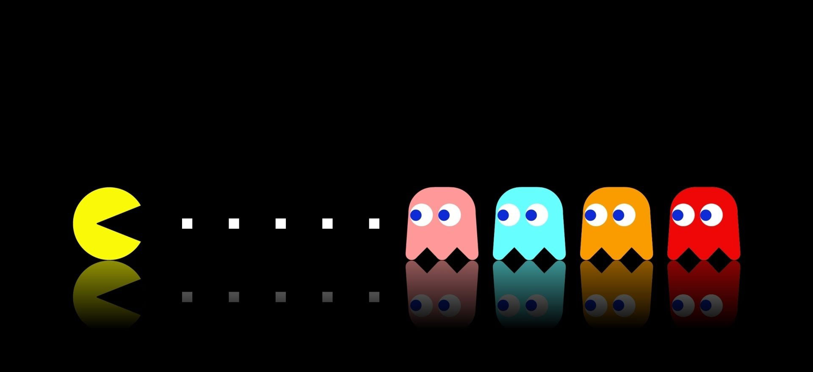
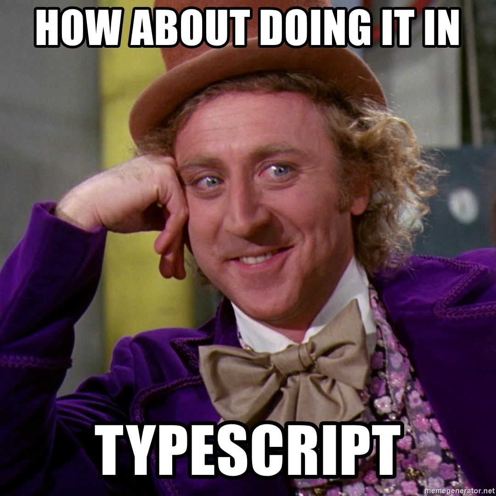
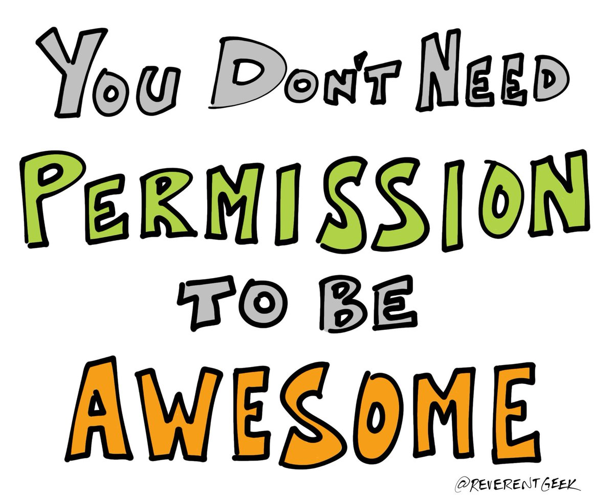

import { Appear, Image, Code, Notes, Head } from "mdx-deck";
import { FullScreenCode, SplitRight } from "mdx-deck/layouts";
import { CodeSurfer } from "mdx-deck-code-surfer";
import dracula from "prism-react-renderer/themes/dracula";
export { dark as theme } from "mdx-deck/themes";

    
Unit Testing

    
Your Front End Code

<Notes>(press *Option + P*) presenter mode</Notes>

---

<CodeSurfer 
  code={require("raw-loader!./snippets/aboutme.snippet")} 
  lang="json"
  showNumbers={false}
  dark={true}
  />;

<Notes>1) Read Priorities. 2) What do I say about Ramsey Solutions</Notes>

---

  
Some of the questions this talk will answer

  <ul>
      <li>What is a unit test?</li>
      <li>Why should I test my code?</li>      
      <li>What are the Pros/Cons of unit testing?</li>
      <li>What is TDD, BDD, DDD?</li>
      <li>Why do I need mock data?</li>
      <li>What else??????</li>      
  </ul>

---

  
What is a unit test?

  <Appear>
    

      UNIT TESTING is a level of software testing where individual units/
      components of software are tested.
    

  </Appear>

---

  
What about TDD, BDD, and DDD?

<Notes>
  TDD is a software development process that relies on the repetition of a very
  short development cycle. 
  BDD also writes tests before code. BDD writes tests from the users perspective? More on BDD in out example.
  What is TDD??????
  OPINION: When your boss hands you a big project... say adding an additional page to you app with a lot of logic that your going
  to have to create. My thought is to create a unit test(that fails) create the
  function to pass the test and then create the next unit test etc etc...
</Notes>
---

  
Test Driven Development

  <Appear>
    

      Boss: Can you make a function that adds 2 numbers?
    

    
Me: I think so....

  </Appear>

---

<CodeSurfer 
  code={require("raw-loader!./snippets/addtest.snippet")} 
  title="Tests for Add Function"
  lang="javascript"
  showNumbers={true}
  dark={true}
  theme={dracula}
      steps={[
    { notes: "These are the tests I would write for a simple Add function"},
    { lines: [1, 28], notes: "Describe is helpful to define what function is being tested. More on that in a few minutes" }, 
    { range: [2, 4], notes: "I always start with the most straight forward test." },    
    { range: [6, 8], notes: "I assume we want this to work with a negative number?" },
    { range: [10, 13], notes: "Writing tests forces you to think about edge cases." }, 
    { range: [15, 18], notes: "When writing tests plan for as many use cases as you can think of." },
    { range: [20, 23], notes: "What about decimal values?" },
    { range: [25, 27], notes: "Probably not going to happen, but what about an empty string?" }
  ]}
  />;

<Notes>
  Using BDD we would ask. How is the user interaction with this function? Will
  they be entering the 2 input values? If they will enter them, will the input
  have safe guards to prevent strings, or booleans values?
</Notes>

---

<CodeSurfer 
  code={require("raw-loader!./snippets/addfunctionfp.snippet")} 
  lang="javascript"
  title="3 out of 6 is good enough right?"
  showNumbers={true}
  dark={true}
  theme={dracula}
    steps={[
    { notes: "Looks like I'm half way there."},
    { range: [1, 4], notes: "Takes is to variables adds them together and returns an answer. Done!" },  
    { range: [7, 14], notes: "My easy tests are passing." },
    { range: [15, 18], notes: "I passed two values why the heck did it return \"12\"?" },
    { range: [19, 22], notes: "I'll admit this probably isn't likely, but it's better to have it covered just in case." },
    { range: [23, 26], notes: "That was easy to." },
    { range: [27, 30], notes: "Stupid strings!!!!!" },
  ]}
  />;

---

<CodeSurfer 
  code={require("raw-loader!./snippets/addfunctionsp.snippet")} 
  lang="javascript"
  title="6 out of 6 is even better!"
  showNumbers={true}
  dark={true}
  theme={dracula}
    steps={[
    { notes: ""},
    { range: [1, 6], notes: "THIS IS SPARTA.... Sorry this is real world code." },  
    { range: [9, 16], notes: "I added additional code and these tests are still passing. I can't tell you how much that boost my confidence in the code I'm shipping." },
    { range: [17, 20], notes: "That's what's suppose to happen when you pass 2 strings." },
    { range: [21, 24], notes: "Probably not going to happen, but aleast when asks you about passing boolean values you can answer confidently." },
    { range: [25, 28], notes: "My confidence is going!" },
    { range: [27, 30], notes: "I can even handle stupid use cases that probably won't happen." },
  ]}
  />;

---

  

    WARNING
    

      
        ...pulls out soap box...
      
    

  

---

---

<CodeSurfer 
  code={require("raw-loader!./snippets/addfunctiontsx.snippet")} 
  lang="javascript"
  title="Typescript Implementation of Add function"
  showNumbers={true}
  theme={dracula}
  dark={true}
    steps={[
    { notes: "Hey that's cheating. Where are those dumb tests you had earlier???"},
    { range: [1, 4], notes: "Looks almost like the first implementation of the Add function written in javascript." },  
    { tokens: {2: [10, 11, 12, 13, 14, 15, 16]}, notes: "What is :number?" },
    { range: [6, 20], notes: "You will receive an error if you try to pass anything besides a number." }
  ]}
  />;

---

  
Enough stalling let's look at some real code!

---

  

    I survived the coding part!!!!!
    

      
        ...now back to my safe zone...slides...
      
    

  

---

  
My Thoughts on Unit Testing

<Notes>
  1) Unit testing is like picking a framework. There are a lot of options to choose from, but do your research and use the one you like best.
  2) Like learning a new framework your going to make mistakes. Your going to write crappy tests. Keep going! 
  3) When QA sends your code back with a bug learn from the mistake and write a test to cover the usecase they found. Testing is not going to replace QA.
  4) The more tests you write the better your tests will be and the more bug you will catch before they get to QA or worse PROD!
  5) TODO: What else????
</Notes>

---

What questions can I answer?

---

  
Special Thanks

  <ul>
      <li>Shaun Willis</li>
      <li>BoroDev Community</li>      
      <li>Vaco and Charter Communications(Spectrum Reach)</li>
      <li>My(former) co-worker at CJC for helping me come up with content for this
      presentation. I love you guys!</li>    
  </ul>

---

  
Technology Used

  <ul>
      <li>React</li>
      <li>MDX-Deck for slides</li>      
      <li>CodeSurfer for Code Highlighting</li> 
  </ul>

---

  
Thank you for coming!

